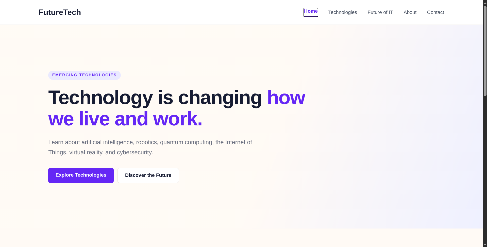
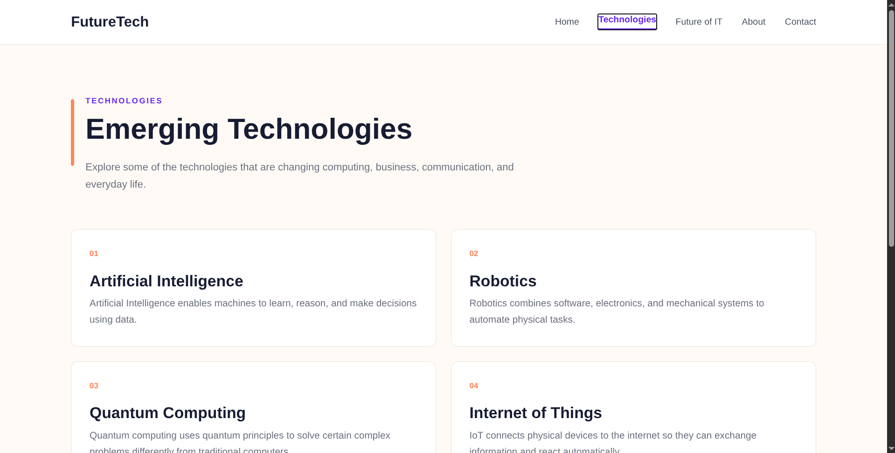

# FutureTech

FutureTech is a ReactJS web application.

The website provides information about emerging technologies and how they are changing the world around us. It covers topics such as Artificial Intelligence, Robotics, Quantum Computing, Internet of Things, Virtual Reality, and Cybersecurity.

## Technologies Used

- ReactJS
- JavaScript
- CSS
- Vite
- React Router
- Git and GitHub

## Main Pages

### Home
Introduces the website and provides quick access to the main technology topics.

### Technologies
Provides information about different emerging technologies including AI, Robotics, Quantum Computing, IoT, VR, and Cybersecurity.

### Future of IT
Discusses possible future developments in information technology and how technology may affect different areas of our lives.

### About
Explains the purpose of the FutureTech project and the topics covered by the website.

### Contact
Contains a simple contact form where visitors can enter their name, email, subject, and message.

## Features

- Responsive design
- Desktop, tablet, and mobile support
- React Router navigation
- Mobile navigation menu
- Interactive contact form
- Technology information cards
- Clean and simple user interface

## How to Run the Project

First, clone the repository:

```bash
git clone YOUR_REPOSITORY_URL
```

Enter the project directory:

```bash
cd futuretech
```

Install the required packages:

```bash
npm install
```

Start the development server:

```bash
npm run dev
```

Then open the local address displayed in the terminal.

Usually:

```text
http://localhost:5173
```

## Screenshots

### Home Page



### Technologies Page



### Mobile View


## Project Structure

```text
futuretech/
├── src/
│   ├── components/
│   │   ├── Navbar.jsx
│   │   ├── Hero.jsx
│   │   ├── Technologies.jsx
│   │   └── Footer.jsx
│   │
│   ├── pages/
│   │   ├── TechnologiesPage.jsx
│   │   ├── FuturePage.jsx
│   │   ├── AboutPage.jsx
│   │   └── ContactPage.jsx
│   │
│   ├── App.jsx
│   ├── App.css
│   └── index.css
│
├── screenshots/
├── package.json
└── README.md
```

## Course Information

**Course:** CSCI390 - Web Programming  
**Project:** FutureTech  
**Year:** 2026
